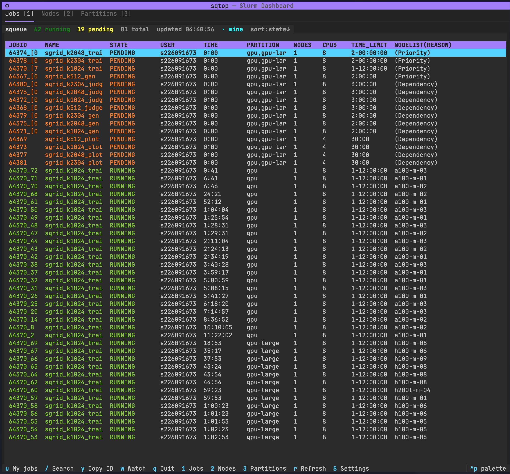

# sqtop

`sqtop` is a TUI dashboard for Slurm clusters.



## Install

### Option 1: install from GitHub with uv tool

```bash
uv tool install git+https://github.com/t3bol90/sqtop.git
```

### Option 2: install from local source checkout

```bash
git clone https://github.com/t3bol90/sqtop.git
cd sqtop
uv tool install .
```

### Upgrade

```bash
uv tool upgrade sqtop
```

## Usage

Run:

```bash
sqtop
```

Prerequisite: Slurm CLI commands (`squeue`, `sinfo`, `scontrol`, `scancel`) must be available in `PATH`.

If you run with this repo's local Docker-backed cluster shims, use:

```bash
./run.sh
```

## Config

Config file path:

```bash
~/.config/sqtop/config.toml
```

You can cap jobs-table text width (content longer than cap is truncated with `...`):

```toml
theme = "dracula"
interval = 2.0

[jobs]
name_max = 24
user_max = 12
partition_max = 14
nodelist_reason_max = 40

[attach]
enabled = true
default_command = "$SHELL -l"
extra_args = ""
```

Attach behavior:
- Attach actions are available from `Enter` on a `RUNNING` job.
- sqtop suspends while the interactive `srun --pty` session is active.
- Exit the shell to return to sqtop.

## Keybindings

### Global

| Key | Action |
|---|---|
| `1` | Jobs tab |
| `2` | Nodes tab |
| `3` | Partitions tab |
| `r` | Refresh all tabs |
| `S` | Open settings |
| `q` | Quit |

### Jobs tab

| Key | Action |
|---|---|
| `Enter` | Open job actions |
| `u` | Toggle only-my-jobs filter |
| `/` | Open search |
| `s` | Sort by state (toggle asc/desc) |
| `t` | Sort by time |
| `c` | Sort by CPUs |
| `y` | Copy selected job ID |
| `w` | Toggle watch on selected job |

### Nodes tab

| Key | Action |
|---|---|
| `Enter` | Open node details |
| `s` | Sort by state |
| `p` | Sort by CPU% |
| `m` | Sort by free memory |

### Partitions tab

| Key | Action |
|---|---|
| `s` | Sort by partition |
| `n` | Sort by nodes |

## Contributing

See [CONTRIBUTION.md](CONTRIBUTION.md) for local development setup and workflow.
