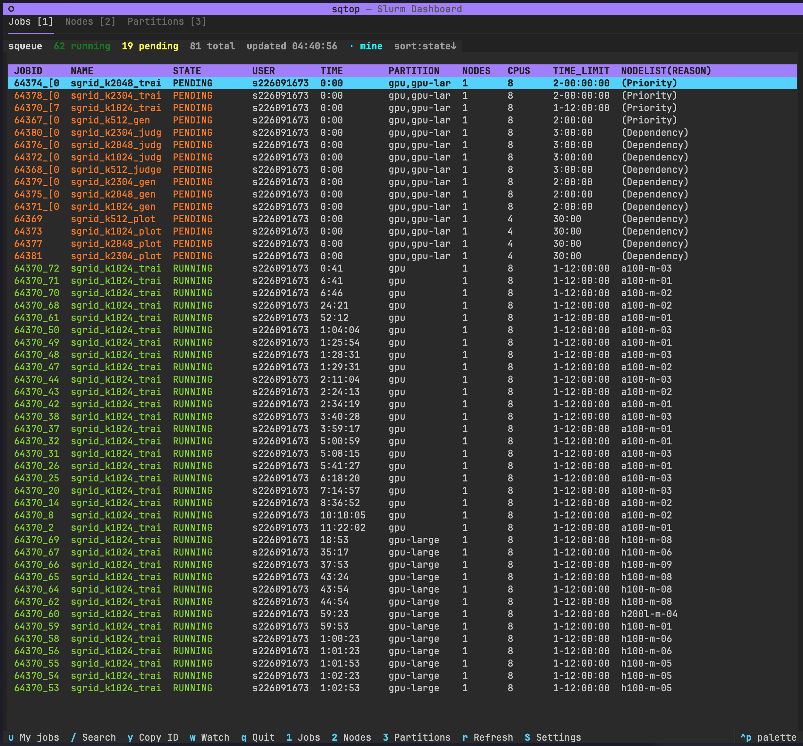

# sqtop

`sqtop` is a TUI dashboard for Slurm clusters.



## Install

### Option 1: install from GitHub with uv tool

```bash
uv tool install git+https://github.com/t3bol90/sqtop.git
```

### Option 2: install from local source checkout

```bash
git clone https://github.com/t3bol90/sqtop.git
cd sqtop
uv tool install .
```

### Upgrade

```bash
uv tool upgrade sqtop
```

## Usage

Run:

```bash
sqtop
```

Prerequisite: Slurm CLI commands (`squeue`, `sinfo`, `scontrol`, `scancel`) must be available in `PATH`.

Remote cluster via SSH (uses your existing `~/.ssh/config`):

```bash
sqtop --remote my-cluster
```

`my-cluster` can be any SSH host alias or host string that already works with `ssh my-cluster`.
If needed, you can still override identity file per run:

```bash
sqtop --remote my-cluster --ssh-key ~/.ssh/id_ed25519
```

If you run with this repo's local Docker-backed cluster shims, use:

```bash
./run.sh
```

## Copying data

### Quick reference

| Key | Action |
|---|---|
| `y` | Copy job ID (Jobs) / yank visual selection |
| `Y` | Copy current row as TSV (Jobs only) |
| `v` | Enter visual selection mode (data tables) |
| `V` | Enter visual-line mode (data tables) |
| `Esc` | Exit visual mode |
| `Ctrl+Shift+Y` | Copy entire pane as TSV (all views) |
| `Ctrl+C` | Copy selection in text-pane modals |

### Selection vs pane copy

`y` / `Y` operate on the current row or a visual selection (`v` to start, move, then `y` to yank). `Ctrl+Shift+Y` copies the entire visible (post-filter, post-sort) table as TSV with a header row — useful for pasting into a spreadsheet or a Markdown table.

### SSH + tmux

sqtop uses **OSC 52** to copy: it writes an escape sequence to the TTY and the **local** terminal emulator on your laptop intercepts it and writes to the local clipboard. No `xclip` on the server, no X forwarding required.

If your session goes through **tmux** (very common: `ssh login01`, then `tmux attach`), tmux drops OSC 52 by default. Add to your **remote** `~/.tmux.conf`:

```tmux
set -g set-clipboard on
set -g allow-passthrough on   # tmux 3.3+
```

Verify it works end-to-end:

```bash
printf '\e]52;c;%s\a' "$(printf 'sqtop test' | base64)"
```

If your local clipboard now contains `sqtop test`, OSC 52 is working.

**Terminal support:** iTerm2, Kitty, WezTerm, Alacritty, Ghostty, GNOME Terminal (VTE ≥ 0.50), Windows Terminal — all work out of the box. **Terminal.app does not support OSC 52**; switch to one of the above when running over SSH.

**Mosh:** OSC 52 requires mosh ≥ 1.4.

### Size limit

Payloads over ~74 KB are truncated; a warning notification will say so. The full payload goes through if you configure `set-clipboard on` in tmux and your terminal has no cap (WezTerm, Kitty).

### Local fallback

When running locally (not over SSH) and OSC 52 fails silently, sqtop falls back to `pbcopy` (macOS) / `xclip` / `xsel` / `clip` (Windows) if available.

## Config

Config file path:

```bash
~/.config/sqtop/config.toml
```

You can cap jobs-table text width (content longer than cap is truncated with `...`):

```toml
theme = "dracula"
interval = 2.0

[jobs]
name_max = 24
user_max = 12
partition_max = 14
nodelist_reason_max = 40
qos_max = 12

[attach]
enabled = true
default_command = "$SHELL -l"
extra_args = ""

[ui]
expert_mode = false
show_palette_hints = true

[safety]
confirm_cancel_single = true
confirm_bulk_actions = true

[health]
enabled = true
history_size = 100
warn_pending_ratio = 0.7
warn_down_nodes = 1

[remote]
host = "my-cluster"
```

The QOS column appears automatically at terminal widths ≥ 90 characters. The persistent default sort (including sort-by-QOS) is set via the command palette (`S` → "Jobs default sort") and survives restarts.

Attach behavior:
- Attach actions are available from `Enter` on a `RUNNING` job.
- sqtop suspends while the interactive `srun --pty` session is active.
- Exit the shell to return to sqtop.

## Keybindings

### Global

| Key | Action |
|---|---|
| `1` | Jobs tab |
| `2` | Nodes tab |
| `3` | Partitions tab |
| `Ctrl+P` / `S` | Command palette (refresh interval, default sort, expert mode, column visibility, …) |
| `r` | Refresh all tabs |
| `Shift+P` | Save screenshot to `~/.cache/sqtop/screenshots` |
| `Shift+C` | Column visibility toggle for current tab |
| `?` | Show keybindings for current pane |
| `Ctrl+C` | Quit |
| `q` | Quit |

### Jobs tab

| Key | Action |
|---|---|
| `Enter` | Open job actions |
| `u` | Toggle only-my-jobs filter |
| `/` | Open search |
| `Space` | Select/deselect current job |
| `*` | Select all visible jobs |
| `x` | Clear selected jobs |
| `Shift+B` | Bulk actions menu |
| `h` | Hold selected/current job(s) |
| `Shift+R` | Release selected/current job(s) |
| `e` | Requeue selected/current job(s) |
| `s` | Sort by state (toggle asc/desc) |
| `t` | Sort by time |
| `c` | Sort by CPUs |
| `y` | Copy selected job ID |
| `Shift+Y` | Copy current row |
| `w` | Toggle watch on selected job |
| `Shift+D` | View dependency tree |

### Nodes tab

| Key | Action |
|---|---|
| `Enter` | Open node details |
| `s` | Sort by state |
| `p` | Sort by CPU% |
| `m` | Sort by free memory |

### Partitions tab

| Key | Action |
|---|---|
| `s` | Sort by partition |
| `n` | Sort by nodes |

## Contributing

See [CONTRIBUTION.md](CONTRIBUTION.md) for local development setup and workflow.
